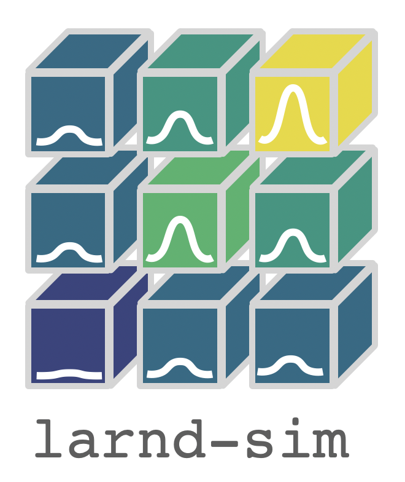

# larnd-sim 

[](https://dune.github.io/larnd-sim)
[](https://doi.org/10.5281/zenodo.4582721)



This software aims to simulate a pixelated Liquid Argon Time Projection Chamber. It consists of a set of highly-parallelized algorithms implemented on the CUDA architecture.

## Overview

The software takes as input an array containing the necessary truth iformation for each simulated segment of deposited energy in the detector (e.g. starting point, amount of energy) and produces a list of packets with an ADC count and timestamp in the [LArPix HDF5 format](https://larpix-control.readthedocs.io/en/stable/api/format/hdf5format.html).

## How to run a simulation

### Input dataset

The input array can be created by converting [edep-sim](https://github.com/ClarkMcGrew/edep-sim) ROOT output files using the `cli/dumpTree.py` script (which is independent from the rest of the software and requires ROOT and Geant4 to be installed).

This script produces a bi-dimensional structured array saved in the HDF5 format, which is used as input for the simulation of the pixel response.

### Command line interface
We provide a command-line interface available at `cli/simulate_pixels.py`, which can run as:

```bash
python cli/simulate_pixels.py \
--input_filename=input_file.h5 \
--detector_properties=larndsim/detector_properties/module0.yaml \
--pixel_layout=larndsim/pixel_layouts/multi_tile_layout-2.2.16.yaml \
--output_filename=output_file.h5 \
--n_tracks=100 
```

The output file will contain the datasets described in the [LArPix HDF5 documentation](https://larpix-control.readthedocs.io/en/stable/api/format/hdf5format.html), plus a dataset `tracks` containing the _true_ energy depositions in the detector, and a dataset `mc_packets_assn`, which has a list of indeces corresponding to the true energy deposition associated to each packet.

## Step-by-step simulation

Here we will describe, step-by-step, how we perform the simulation. A full example is available in the `examples/Step-by-step simulation.ipynb` notebook.

### Quenching and drifting stage

The particles that interact in the TPC ionize the argon atoms. Some of the resulting electrons will immediately recombine with the atoms. This effect is simulated in the `quenching` module.

The remaining electrons travel towards the anode and their spatial distribution is affected by longitudinal and transverse diffusion. The presence of impurities reduces the amount of electrons that reach the anode. These effects are simulated in the `drifting` module.

These two modules modify in place the input array, here called `input_tracks`.

```python
from larndsim import quenching, drifting

TPB = 256
BPG = ceil(tracks.shape[0] / TPB)
quenching.quench[BPG,TPB](input_tracks, consts.birks)
drifting.drift[BPG,TPB](input_tracks)
```

### Pixel simulation stage

Once we have calculated the number and the position of the electrons reaching the anode, we can calculate the current induced on each pixel.
First, we find the pixels interesected by the projection of each track segment on the anode plane using the [Bresenham's line algorithm](https://en.wikipedia.org/wiki/Bresenham%27s_line_algorithm) implented in the `pixels_from_track` module. Due to diffusion, we consider also the neighboring pixels.

```python
from larndsim import pixels_from_track
...
pixels_from_track.get_pixels[BPG,TPB](input_tracks,
                                      active_pixels,
                                      neighboring_pixels,
                                      n_pixels_list,
                                      max_radius)
```

Finally, we calculate the current induced on each pixel using the `tracks_current` function in the `detsim` module. The induced current is stored in the `signals` array, which is a three-dimensional array, where the dimensions correspond to the track segment, the pixel, and the time tick, respectively: `signals[0][1][2]` will contain the current induced by the track `0`, for the pixel `1`, at the time tick `2`.

```python
from larndsim import detsim
...
detsim.tracks_current[BPG,TPB](signals,
                               neighboring_pixels,
                               input_tracks,
                               response)
```

Here, `response` is a Numpy array containing a look-up table with a pre-calculated field response. The file valid for Module0 and SingleCube LArPix tiles is availabe at `larndsim/response.npy`.

### Accessing the signals

The three-dimensional array can contain more than one signal for each pixel at different times. If we want to plot the full induced signal on the pixel, we need to join the signals corresponding to the same pixel. First, we find the start time of each signal with `time_intervals`:

```python
from larndsim import detsim
...
detsim.time_intervals[blockspergrid,threadsperblock](track_starts,
                                                     max_length,
                                                     event_id_map,
                                                     input_tracks)
```

Then, we join them using `sum_pixel_signals`:

```python
from larndsim import detsim
...
detsim.sum_pixel_signals[blockspergrid,threadsperblock](pixels_signals, 
                                                        signals, 
                                                        track_starts, 
                                                        pixel_index_map)
```

### Electronics simulation

Once we have the induced current for each active pixel in the detector we can apply our electronics simulation, which will calculate the ADC values for each pixel:

```python
from larndsim import fee
from numba.cuda.random import create_xoroshiro128p_states
...

rng_states = create_xoroshiro128p_states(TPB * BPG, seed=0)
fee.get_adc_values[BPG,TPB](pixels_signals, 
                            time_ticks, 
                            adc_list, 
                            adc_ticks_list,
                            0,
                            rng_states)
```

where the random states `rng_states` are needed for the noise simulation.

### Backtracking

Here we associate the ADC counts to the track that deposited energy in that specific pixel and it's in time with the signal:

```python
detsim.backtrack_adcs[BPG,TPB](input_tracks,
                               adc_list,
                               adc_ticks_list,
                               track_pixel_map,
                               event_id_map,
                               unique_eventIDs,
                               backtracked_id,
                               0)
```

### Export
The final output is then exported to the [LArPix HDF5 format](https://larpix-control.readthedocs.io/en/stable/api/format/hdf5format.html):
```python
fee.export_to_hdf5(adc_list, adc_ticks_list, unique_pix, "example.h5")
```
