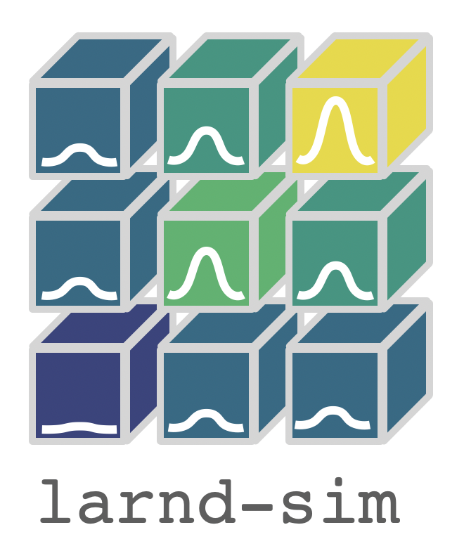

# larnd-sim


[](https://dune.github.io/larnd-sim)
[](https://doi.org/10.5281/zenodo.4582721)



This software aims to simulate the light readout and the pixelated charge readout of a Liquid Argon Time Projection Chamber (LAr-TPC). It consists of a set of highly-parallelized algorithms implemented on the [CUDA architecture](https://developer.nvidia.com/cuda-toolkit) using [Numba](https://numba.pydata.org) and [CuPy](https://cupy.dev/) with a driver written in Python.

Software documentation is available [here](https://dune.github.io/larnd-sim/index.html). In addition, a paper describing larnd-sim architecture and performance can be found [here](https://iopscience.iop.org/article/10.1088/1748-0221/18/04/P04034).

## Overview

The software takes as input a dataset containing segments of deposited energy in the detector, (typically) generated with a [Geant4](https://geant4.web.cern.ch) wrapper called [`edep-sim`](https://github.com/ClarkMcGrew/edep-sim) (see [Input Dataset](#input-dataset)). The simulation is executed using a driver script that performs the data pre-processing, each step/kernel in the pipeline, and saves the output. The output is the simulated data packets from the front-end electronics for the charge data, the simulated light waveforms, and Monte Carlo truth information (where available).

A sketch of the simulation pipeline (see the paper for more details):
```
Geant4/edep-sim (.root)
     │
     ▼  cli/dumpTree.py
HDF5 segments file (.hdf5)
     │
     ▼  simulate_pixels.py
     │
     ├─► Quenching (recombination model: Box or Birks)
     ├─► Drifting  (electron transport, diffusion, lifetime)
     ├─► Charge simulation
     └───► Induced current (pixel response using the Shockley-Ramo theorem)
     └───► Front-end elec. (electronics readout, e.g. ADC, noise, etc.)
     ├─► Light simulation
     └───► Photocurrent  (visibility look-up table, scintillation)
     └───► Optical elec. (electronics readout, e.g. SiPM response, noise, etc.)
     │
     ▼
HDF5 output (charge data packets + light waveforms + Monte Carlo truth)
```

## Installation

The package can be installed using pip from the Git repository, for example:

```bash
git clone https://github.com/DUNE/larnd-sim.git
cd larnd-sim
pip install .
```

and this will install the required dependencies. The GPU libraries/packages may take a while to install, in particular `cupy`. This can be considerably sped up by pre-installing `cupy` precompiled binaries, available [here](https://docs.cupy.dev/en/stable/install.html#installing-cupy). The version will depend on the version of CUDA installed on your system. If you already have `cupy` installed in your environment which meets `larnd-sim`'s requirements, you can execute `export SKIP_CUPY_INSTALL=1` to skip cupy installation before running `pip install .`.

`larnd-sim` requires a CUDA-compatible GPU to function properly. One method to check if the GPU is setup properly and can be accessed is the following:

```python
>>> from numba.cuda import is_available
>>> is_available()
```

## How to run a simulation

### Command line interface
The simulation is run using `cli/simulate_pixels.py`, for example:

```bash
simulate_pixels.py (--config CONFIG_KEYWORD) --input_filename INPUT_FILENAME --output_filename OUTPUT_FILENAME
```

Valid configurations for `CONFIG_KEYWORD` can be found in `larndsim/config/config.yaml` with several common configurations listed below. The default configuration if `--config` is not provided is `2x2`.

- `module0` is for simulating non-beam events in a single 2x2-style module setup (tuned for module0 cosmic data taking). Note that to apply this on other 2x2 single modules, small changes in charge or light detector configuration may be required. See **Configuration details** for further information. The detector geometry corresponds to `module0.gdml`.

- `2x2` is for simulating NuMI beam events in the 2x2 detector with four modules arranged on a 2x2 grid. In this configuration, module variations are enabled to allow for each module to have different hardware properties, and in particular Module 2 with a different pixel pitch. The detector geometry corresponds to [Merged2x2MINERvA_v4_withRock.gdml](https://github.com/DUNE/ND_Production/blob/main/geometry/Merged2x2MINERvA_v4/Merged2x2MINERvA_v4_withRock.gdml).

- `2x2_no_modvar` is for simulating NuMI beam events in the 2x2 detector where each module uses an identical setup for hardware/layout. The detector position corresponds to the same gdml for `2x2`.

- `fsd` is for simulating cosmic ray events in the Full Scale Demonstrator (FSD) prototype. The FSD is a single module with dimensions matching the full ND-LAr specifications, and uses a later version of the pixel electronics compared to the 2x2. The detector geometry corresponds to [fsd_with_cryostat.gdml](https://github.com/DUNE/ND_Production/blob/main/geometry/fsd_with_cryostat.gdml)

- `ndlar` is for simulating beam events in the full DUNE ND-LAr detector using the NuMI beam properties. In the configuration, all the modules are considered to have same configuration.

Alternatively, the simulation can be run with explicit configuration options provided on the command line such as (assuming it is run at the top level of the directory `larnd-sim/.`):

```bash
simulate_pixels.py \
--input_filename=INPUT_FOR_A_2x2_BEAM_EXAMPLE.h5 \
--output_filename=OUTPUT_FOR_A_2x2_BEAM_EXAMPLE.h5 \
--mod2mod_variation=False \
--pixel_layout=larndsim/pixel_layouts/multi_tile_layout-2.4.16.yaml \
--detector_properties=larndsim/detector_properties/2x2.yaml \
--response_file=larndsim/bin/response_44.npy \
--light_simulated=True \
--light_lut_filename=larndsim/bin/lightLUT.npz \
--light_det_noise_filename=larndsim/bin/light_noise_2x2_4mod_July2023.npy
```

Note that any option not specified will use its default, so in order to control the configuration thoroughly and properly, please pass at least the list of arguments above. This can also be used to only change one part of a given configuration, for example to change only the pixel/tile layout:

```bash
simulate_pixels.py --config 2x2 --pixel_layout=larndsim/pixel_layouts/multi_tile_layout-2.5.16.yaml\
--input_filename INPUT_FILENAME --output_filename OUTPUT_FILENAME
```

### Input dataset

The input array is (usually) created by converting [edep-sim](https://github.com/ClarkMcGrew/edep-sim) ROOT output files using the `cli/dumpTree.py` script (which is independent from the rest of the software and requires ROOT and Geant4 to be installed). This script parses the ROOT output and stores a subset of the data in numpy structured arrays in an HDF5 file format.

Other sources of energy deposists can be used as long as they match the input format expected, but this repository only provides a script for edep-sim ROOT to larnd-sim HDF5 conversion.

### Output dataset
Detailed file data definition can be found in the [2x2_sim wiki](https://github.com/DUNE/2x2_sim/wiki/File-data-definitions).

Briefly, the larnd-sim output includes generator truth information, edep-sim/geant4 truth information, simulated charge detector output, charge backtracking information, detector propagated light truth information, simulated light detector output and light backtracking information.

The generator truth information includes `mc_hdr` and `mc_stack` which are reserved for neutrino interaction records. `mc_hdr` is the log for neutrino interactions, and `mc_stack` is the log for the initial-state and final-state particles from the neutrino interactions. This part is copied directly from the root converted h5 input file. If the upstream simulation does not run neutrino generator, rather cosmic or particle bomb simulation instead, then this information will not be presented in the output.

The edep-sim/Geant4 truth information contains `vertices` (interaction-level or equivalent), `trajectories` (particle-level) and `segments` (segment of energy depositions). Primary trajectories should overlap with the final-state particles in `mc_stack` if it originates from neutrino generators. `segments` is the essential input to the simulation. This part should exist in the output regardless the simulation setup, and it is a direct copy of the corresponding part in the input with possible minor extensions such as event time (vertices['t_event']).

The simulated charge detector output is stored in `packets` which is compatible with the converted raw data from LArPix. A data packet could be considered as a point-like charge readout in time and the LArPix plane (anode). It encodes information of the readout charge, position and time. Other type of packets such as trigger, timestamp and sync are also available in the simulated `packets` dataset. A general description can be found in [the LArPix HDF5 documentation](https://larpix-control.readthedocs.io/en/stable/api/format/hdf5format.html).

The charge backtracking information is namely `mc_packets_assn` which records the contribution of `segments` to each packet. It has the same size as the `packets` dataset, and the index are shared between `packets` and `mc_packets_assn`. Each packet is associated with backtracking information of `event_ids`, `segment_ids` and `fraction` regardless its packet type. However, only the data packets can have meaningful backtracking information filled. `event_ids` is a new feature implemented in [this commit](https://github.com/DUNE/larnd-sim/commit/2346070fdd0ad681f30285a380175b559faf6da0). It has a size of one and contains the true event_id. The length of `segment_ids` and `fraction` are the same and are set by fee.ASSOCIATION_COUNT_TO_STORE. The contributed segments are sorted by their fractional order and filled correspondingly for `segment_ids` and `fraction`. The total number of contribution considered in the calculation ofsegment fraction is set by fee.MAX_ADC_VALUES. It makes sense to set fee.MAX_ADC_VALUES >= fee.ASSOCIATION_COUNT_TO_STORE. Please see [this Git Isuue](https://github.com/DUNE/larnd-sim/issues/137) for further details and discussion.

The detector propagated light truth information is saved as `light_dat`. If the module-by-module variation is turned on, the simulation is carried out for each module separately, and this information is stored for each module as `light_dat/light_dat_module{Z}` where Z is the module numbering. Otherwise, the information is recorded under `light_dat/light_dat_allmodules`. It has the shape of (#segments, #light readout channels), where the #segments and #light readout channels are within individual modules or the whole detector respectively. Each segment is labelled by `segment_id`. `n_photons_det` -- the number of photons which would detected by the SiPM, and `t0_det` -- the light arrival time on the SiPMs, are also provided in this dataset.

The simulated light detector output are `light_trig`and `light_wvfm`. Currently in `larnd-sim`, we have implemented two trigger mode: threshold (light.LIGHT_TRIG_MODE = 0) and beam (light.LIGHT_TRIG_MODE = 1) trigger that activate all light readout channels. See [this Git Isuue](https://github.com/DUNE/larnd-sim/issues/181) for the discussion of light triggers in `larnd-sim`. `light_trig` has the shape of number of light triggers. In case of beam triggering mode, the number of light triggers is the same as the simulated events (beam spills) in the input. Therefore, not necessarily all light triggers correspond to charge and meaningful light signals. `light_trig` has attributes of `op_channel`, `ts_s` and `ts_sync`. `op_channel` records the triggered light readout channels. For light.LIGHT_TRIG_MODE = 0 and 1, `op_channel` stores all the light readout channel id. `ts_s` is the trigger time in seconds, and `ts_sync` is the trigger time in LArPix time ticks which considers the time sync, e.g PPS or LArPix clock rollover. `light_wvfm` has the shape of (#light triggers, #light readout channels, #light samples). The #light triggers is the same as in `light_trig`. For light.LIGHT_TRIG_MODE = 0 and 1, #light readout channels is the number of all the available channels in the entire detector. #light samples are determined by light.LIGHT_TRIG_WINDOW and light.LIGHT_DIGIT_SAMPLE_SPACING. For a light trigger and a readout channel `light_wvfm` gives a waveform as in the light readout data. The waveforms are in digitized ADC counts. For 2x2, and the cosmic data taking with Module 123, due to the setup, in order to get the ADC counts correspond to the light signal, the waveform values needs to be divided by 4. Note that the internal light simulation can have higher resolution before digitization if the light.LIGHT_TICK_SIZE is set to a smaller number.

The light backtracking information will be stored in `light_wvfm_mc` if light.MAX_MC_TRUTH_IDS is set to a non-zero value. `light_wvfm_mc` has the same shape as `light_wvfm`, (#light triggers, #light readout channels, #light samples). At one time sample of a light readout channel from one trigger, it stores `segment_ids` and `pe_current` with the length of light.MAX_MC_TRUTH_IDS.

For all light related datasets, as `larnd-sim` currently does not consider a complicated or realistic light readout channel mapping, their order is as the channel id which follows geometrical order sequentially from bottom to top, TPC-by-TPC.

### Configuration files
- **Pixel layout:** They are typically stored in `larndsim/pixel_layouts`. `multi_tile_layout-2.3.16.yaml` is a pixel layout file tailored for Module0 with realistic off channels/chips. `multi_tile_layout-2.4.16.yaml` is a generic LArPix *v2a* layout for a 2x2 module, and `multi_tile_layout-2.5.16.yaml` is a generic LArPix *v2b* layout for a 2x2 module. For both `2.4.16` and `2.5.16`, all the channels (pixels) are activated. `multi_tile_layout-3.0.40.yaml` is a generic LArPix *v2b*/*v3* layout for a ND-LAr module. `.16` and `.40` indicate the number of tiles. The pixel layout files provide information of channel mapping, pixel_pitch, tile_positions, tile orientation, tpc position etc. It is produced using [larpix-geometry](https://github.com/larpix/larpix-geometry/tree/master) (`larpixgeometry/layouts/multi_tile_layout.py` for example).
- **Detector properties:** The detector properties are passed to the simulation through a yaml file. Examples can be found in `larndsim/detector_properties`. The e_field, lifetime, response sampling and response bin size can be set differently for different modules. The detector properties are loaded to `larndsim/consts/detector.py` and `larndsim/consts/light.py`.
- **Simulation properties:** The parameters for simulation properties are set in a yaml file typically stored in `larndsim/simulation_properties`. The simulation properties are loaded to `larndsim/consts/sim.py`.
- **Pixel pesponse file:** The pixel response file is a look-up table for the near-field charge induction modeling. An electric field simulation with finite-element-method (FEM) is used to produce the response file for a given pixel layout. The look-up tables are typically stored in `larndsim/bin`. `response_44.npy` is for pixel with 4.4 mm pitch (LArPix *v2a*-like), and `response_38.npy` is for pixel with 3.8 mm pitch (LArPix *v2b*/*v3*-like). Note that the setting in the detector properties need to be adjusted accordingly.
- **Light look-up table (LUT):** A light LUT used in larnd-sim provides the "visibility" of photons from TPC volumes to the light readout channels. They are outputs of Geant4 simulation of the light propagation that are stored as ROOT files. [The script here](https://github.com/DUNE/ArgonCubeLUTSim) has been used to translate it into the format that `larnd-sim` consumes. An example of a 2x2 module light LUT can be found in `larnd-sim` as `larndsim/bin/lightLUT.npz`. Due to the file size, the latest high-resolution 2x2 light LUT are not in this repository but can be found on [NERSC web portal](https://portal.nersc.gov/project/dune/data/2x2/simulation/larndsim_data/light_LUT/) and `/global/cfs/cdirs/dune/www/data/2x2/simulation/larndsim_data/light_LUT`.
- **Light detector noise:** An example of the light detector noise for 2x2 can be found `larndsim/bin/light_noise_2x2_4mod_July2023.npy`. It has the noise profile for each light readout channel, and was extracted based on the single module cosmic runs.
- **Bad channels (optional):** LArPix channels flagged as bad channels will be deactivated in the simulation.
- **Pixel thresholds (optional):** The file gives channel-by-channel discriminator threshold for the charge simulation. If it is not provided, the threshold is considered to be the same for every LArPix channel and is set by detector.DISCRIMINATION_THRESHOLD.
- **Pixel pedestals (optional):** The file gives channel-by-channel pedestal values for the charge simulation. If it is not provided, the pedestal is considered to be the same for every LArPix channel and is set by detector.V_PEDESTAL.
- **Pixel gains (optional):** This configuration provides channel-by-channel gain factor for the charge simulation. If it is not given, the gain is considered to be the same for every LArPix channel and is set by detector.GAIN for all channels.

## Future developments
`larnd-sim` is fairly mature for the detector simulation that it is in vision to be. However, various developments are still needed to further improve the simulation. [The Git Issues](https://github.com/DUNE/larnd-sim/issues) provides a peek into the wishlist. We welcome your contribution!

Currently, the development of `larnd-sim` is coordinated by Jaafar Chakrani (@jaafar-chakrani, LBNL), Kevin Wood (@krwood, LBNL), Yifan Chen (@YifanC, SLAC) and Matt Kramer (@mjkramer, LBNL), as part of the 2x2 simulation effort. The future simulation group of ND-LAr and/or its prototype will continue managing and maintaining `larnd-sim`. Please contact us if you have any suggestions, questions or concerns regarding `larnd-sim`.

Here, we would also like to acknowledge the initial authors of `larnd-sim`, Roberto Soleti (@soleti) and Peter Madigan (@peter-madigan). Thank you and many other contributors that have built `larnd-sim`.
